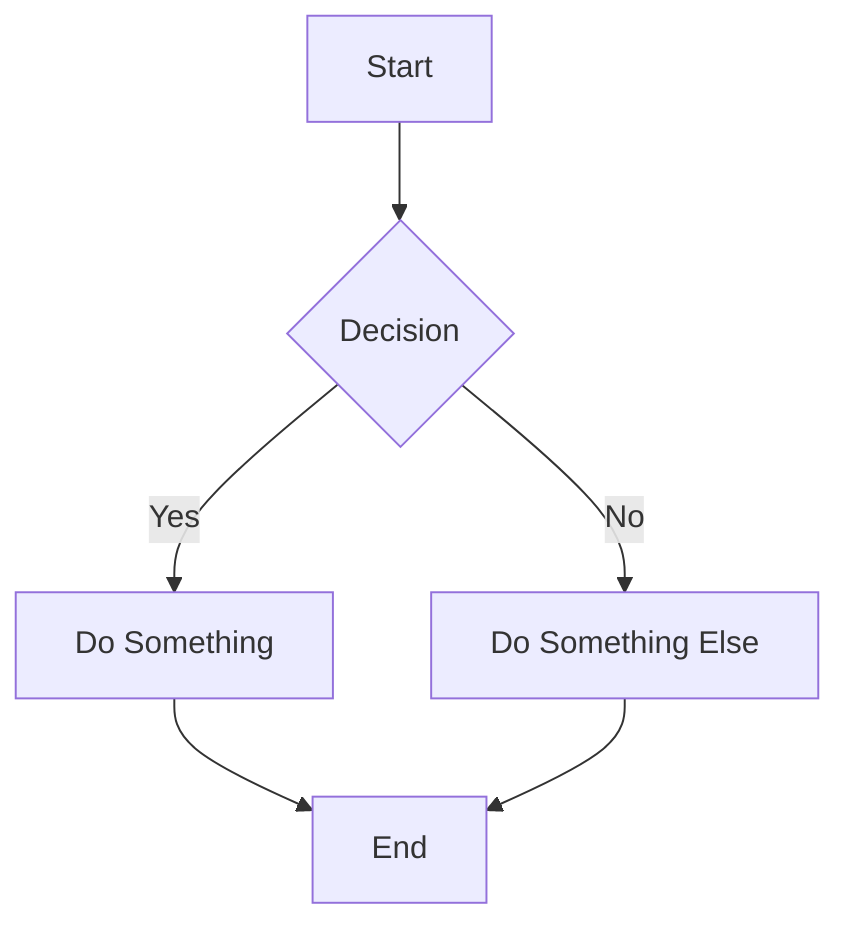

这是所有内容外观的演示。

以下 Markdown 备忘单改编自：[https://guides.github.com/features/mastering-markdown/](https://guides.github.com/features/mastering-markdown/)

# 什么是 Markdown？

Markdown 是一种在网络上设置文本样式的方法。您可以控制文档的显示；将单词格式化为粗体或斜体、添加图像和创建列表只是我们可以使用 Markdown 做的一小部分事情。大多数情况下，Markdown 只是带有一些非字母字符的常规文本，例如 `#` 或 `*`。

# 语法指南

这是 Markdown 语法的概述，您可以在 GitHub.com 或自己的文本文件中随处使用。

## 标题

```markdown
# 这是一个 h1 标签

## 这是一个 h2 标签

#### 这是一个 h4 标签
```

# 这是一个 h1 标签

## 这是一个 h2 标签

#### 这是一个 h4 标签

## 强调

```markdown
_此文本将为斜体_

**此文本将为粗体**

_您 **可以** 组合它们_
```

_此文本将为斜体_

**此文本将为粗体**

_您 **可以** 组合它们_

## 列表

### 无序

```markdown
- 项目 1
- 项目 2
  - 项目 2a
  - 项目 2b
```

- 项目 1
- 项目 2
  - 项目 2a
  - 项目 2b

### 有序

```markdown
1. 项目 1
1. 项目 2
1. 项目 3
   1. 项目 3a
   1. 项目 3b
```

1. 项目 1
2. 项目 2
3. 项目 3
   1. 项目 3a
   2. 项目 3b

## 图像

```markdown

格式: 
```


## 链接

```markdown
http://tina.io - 自动识别！
[TinaCMS](http://tina.io)
```

[http://tina.io](http://tina.io) - 自动识别！
[TinaCMS](http://tina.io)

## 引用

```markdown
正如拿破仑谈到狮虎兽时所说：

> 它是差不多我最喜欢的动物。
> 它就像狮子和老虎的混合体……因其魔法技能而培育。
```

正如拿破仑谈到狮虎兽时所说：

> 它是差不多我最喜欢的动物。
> 它就像狮子和老虎的混合体……因其魔法技能而培育。

## 内联代码

```markdown
我认为你应该在这里使用
`<addr>` 元素。
```

我认为你应该在这里使用
`<addr>` 元素。

## 语法高亮

这是如何使用 [GitHub Flavored Markdown](https://help.github.com/articles/basic-writing-and-formatting-syntax/) 进行语法高亮的示例：

````markdown
```js:fancyAlert.js
function fancyAlert(arg) {
  if (arg) {
    $.facebox({ div: '#foo' })
  }
}
```
````

这是它的外观 - 带有样式化代码标题的漂亮颜色！

```js:fancyAlert.js
function fancyAlert(arg) {
  if (arg) {
    $.facebox({ div: '#foo' })
  }
}
```

## 表格

您可以通过组合单词列表并用连字符 `-`（对于第一行）分隔它们，然后用管道符 `|` 分隔每列来创建表格：

```markdown
| 第一标题                    | 第二标题                     |
| --------------------------- | ---------------------------- |
| 单元格 1 的内容             | 单元格 2 的内容              |
| 第一列的内容                | 第二列的内容                 |
```

| 第一标题                    | 第二标题                     |
| --------------------------- | ---------------------------- |
| 单元格 1 的内容             | 单元格 2 的内容              |
| 第一列的内容                | 第二列的内容                 |

## 图表

您可以使用 Mermaid 图表直接在 Markdown 中可视化流程、序列和其他图表类型。这是 Mermaid 流程图的一个示例：



渲染后，这将创建一个流程图，其中决策导致不同的路径。Mermaid 还支持序列图、甘特图、类图等。有关全部可能性，请查看 Mermaid 文档：[https://mermaid-js.github.io/mermaid/](https://mermaid-js.github.io/mermaid/)
