TinaCMS 旨在通过直观灵活的编辑体验赋予内容创作者权力，我们的 Markdown 支持也不例外。无论您是管理简单的博客还是复杂的文档网站，TinaCMS 都能无缝集成 Markdown，结合了结构化内容的强大功能和实时编辑的便捷性。从标题和链接到图像和自定义语法，TinaCMS 确保您的 Markdown 文件易于管理和自定义，同时保持对内容的完全控制。

## 流程图 (Flowcharts)

使用流程图来可视化过程、决策树或工作流程。它非常适合简化复杂系统或直观地解释逻辑。

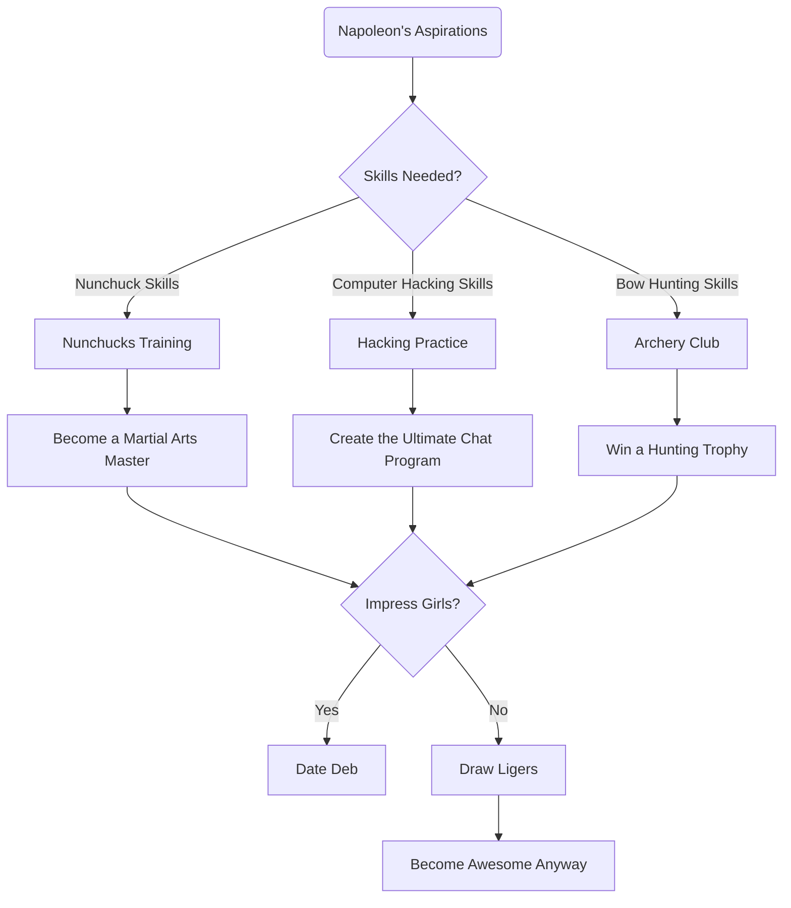

## 序列图 (Sequence Diagram)

使用序列图来说明组件或系统随时间推移的交互，特别是对于 API、工作流程或系统交互。

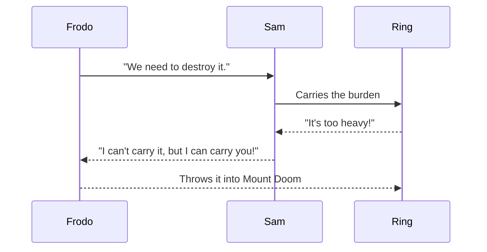

## 类图 (Class Diagram)

使用类图进行面向对象的系统设计，显示类、属性及其关系的结构。

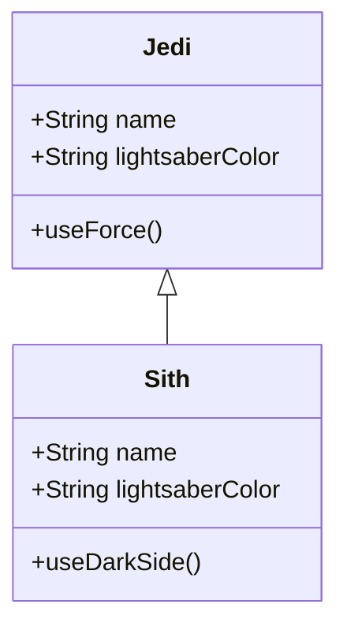

## 状态图 (State Diagram)

使用状态图来表示系统或对象的不同状态以及这些状态之间的转换。

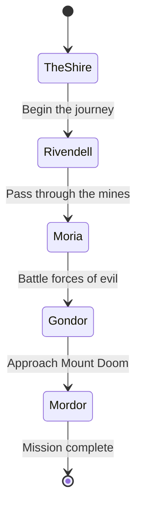

## 实体关系图 (Entity Relationship Diagram)

使用 ER 图来建模数据库结构，显示实体、属性和关系。

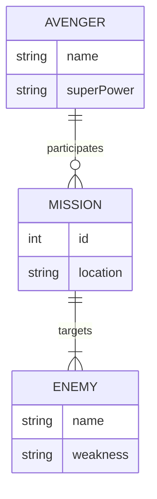

## 用户旅程 (User Journey)

使用用户旅程图来跟踪用户与您的产品或服务的交互，并识别痛点或改进领域。

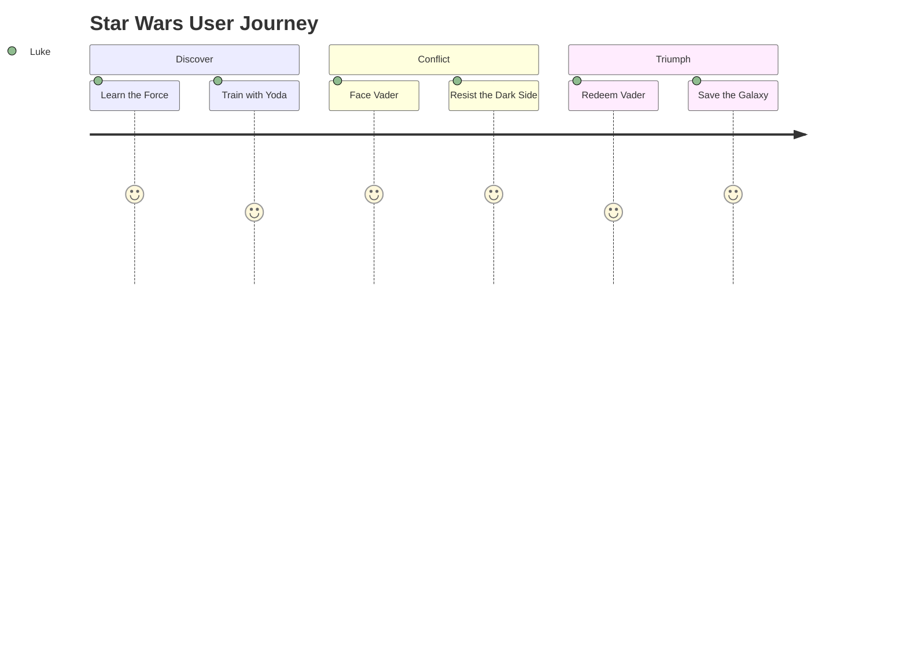

## 甘特图 (Gantt Chart)

使用甘特图来可视化时间表和项目进度，跟踪进度和依赖关系。

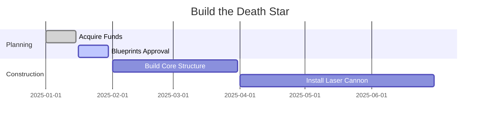

## 饼图 (Pie Chart)

使用饼图直观地表示数据比例，例如资源分配或调查结果。

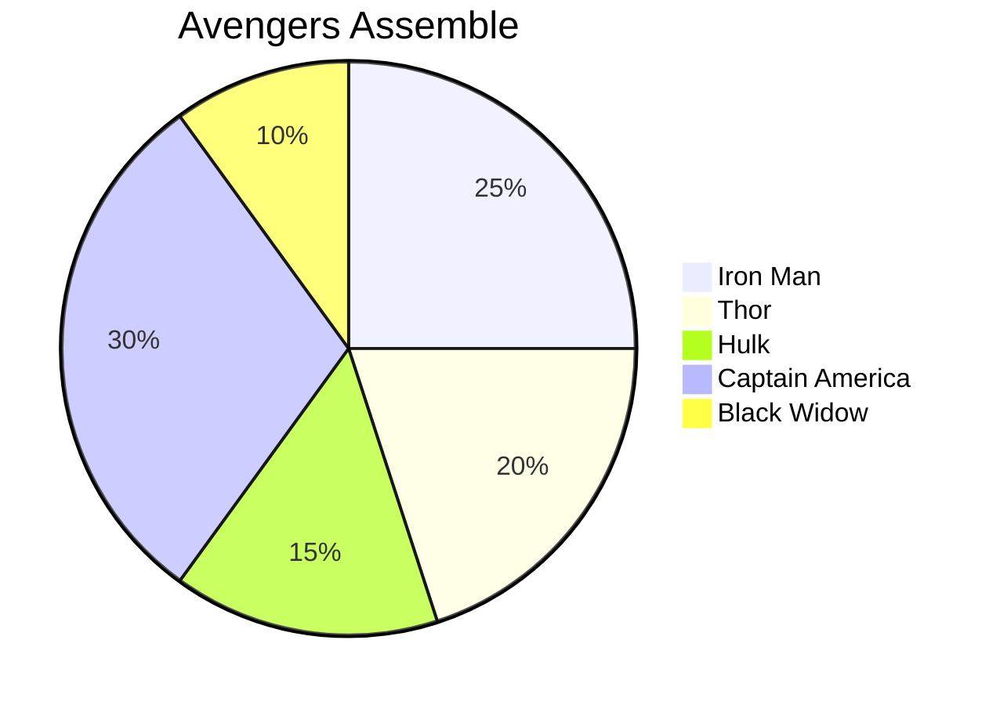

## 象限图 (Quadrant Chart)

使用象限图来确定任务的优先级或跨两个维度可视化元素。

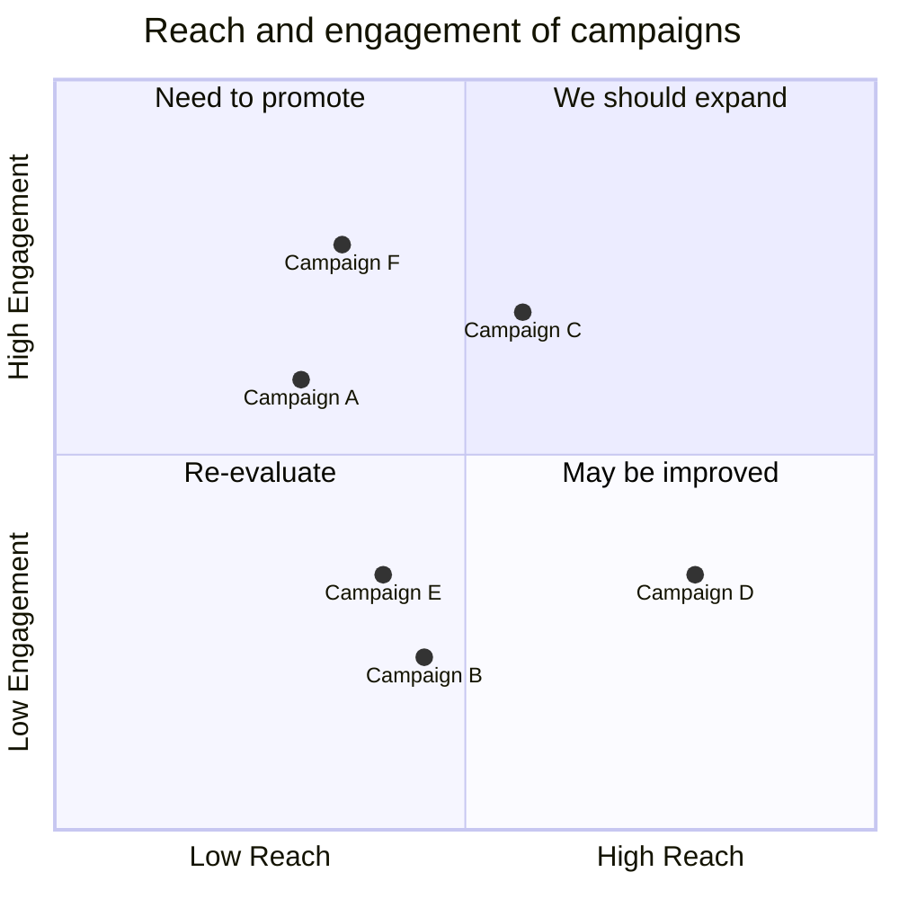

## 需求图 (Requirement Diagram)

使用需求图来跟踪项目需求及其关系。

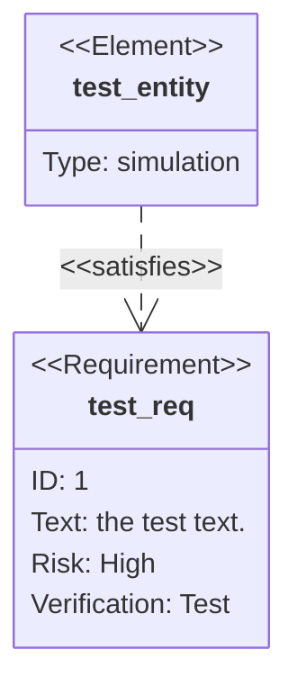

## Gitgraph (Git) 图表

使用 Gitgraph 图表来可视化 Git 工作流程和分支策略。

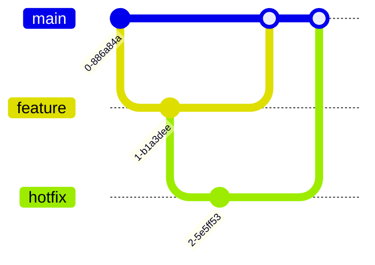

## C4 图 (C4 Diagram)

使用 C4 图进行软件架构设计，显示系统上下文、容器、组件和代码。

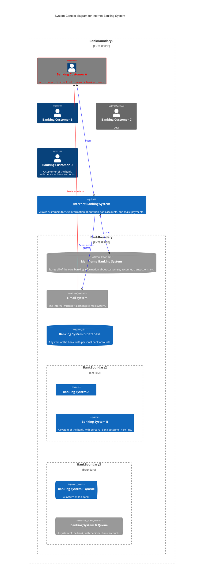

## 思维导图 (Mindmaps)

使用思维导图来集思广益或分层组织信息。

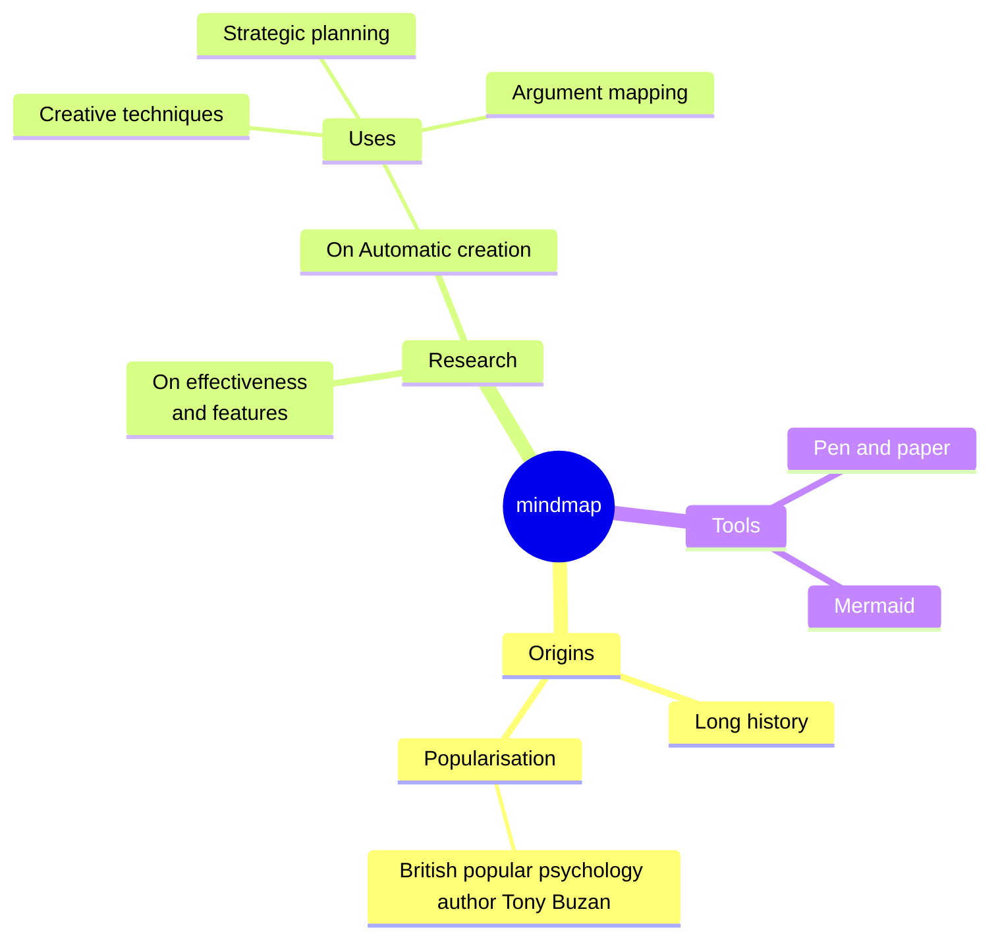

## 时间轴 (Timeline)

使用时间轴按时间顺序显示事件，例如里程碑或历史数据。

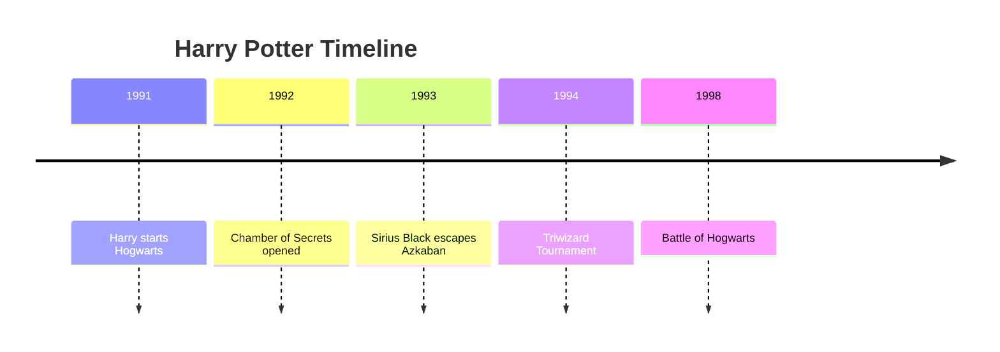

## 桑基图 (Sankey Diagram)

使用桑基图显示阶段之间的资源、能源或数据流。

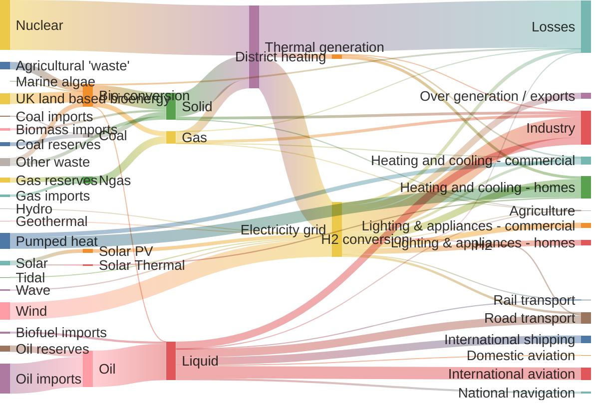

## XY 图表 (XY Chart)

使用 XY 图表来比较两个维度的数据点，例如性能与成本。

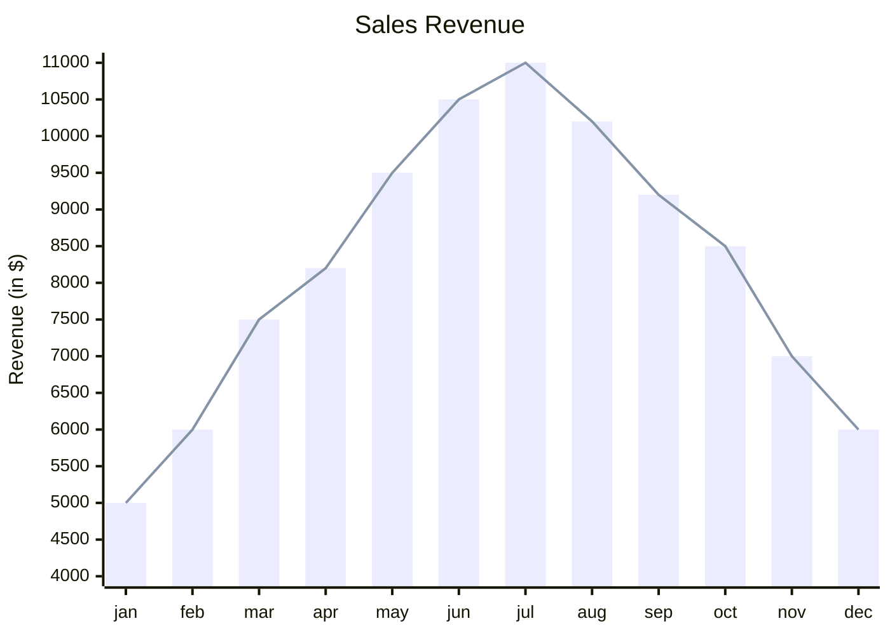

## 数据包图 (Packet Diagram)

何时使用：
使用数据包图来描述网络通信和数据流。

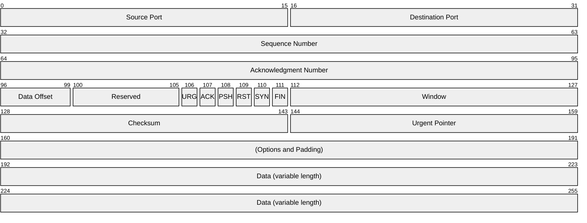

## 看板 (Kanban)

使用看板来可视化工作流程中的工作项及其状态。

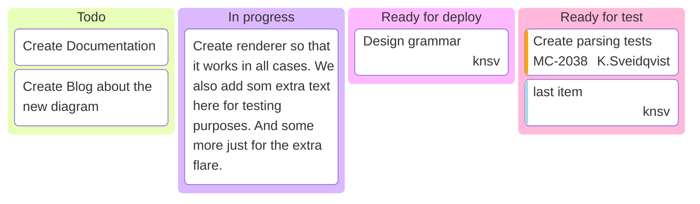

## 架构图 (Architecture Diagram)

使用架构图来表示高级系统组件及其交互。

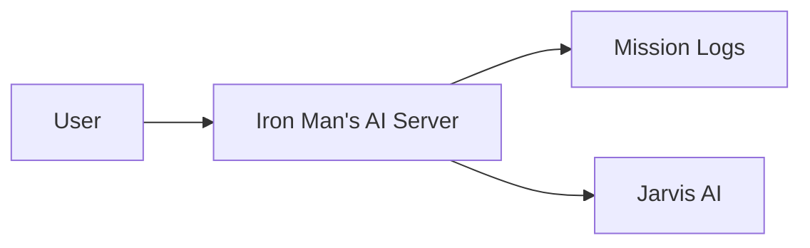
